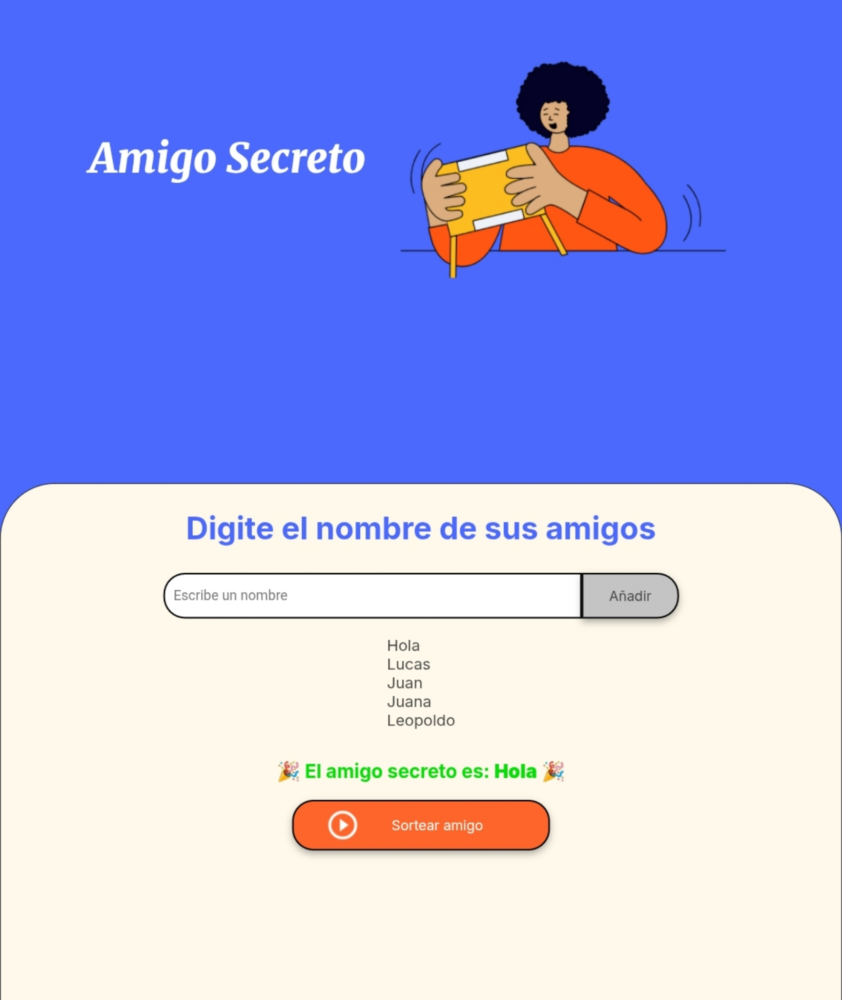

# 🎉 Amigo Secreto

¡Bienvenido/a al proyecto **Amigo Secreto**! 🎁  
Una aplicación web sencilla y divertida que te permite agregar una lista de amigos y sortear uno al azar con solo un clic. Ideal para juegos en grupo, regalos sorpresa o actividades escolares.

Este proyecto fue desarrollado como parte de una tarea de programación web de Alura Latam y Oracle Next Education para practicar la integración de **HTML, CSS y JavaScript** de forma dinámica.

---

## 📸 Vista del proyecto




---

## 🚀 ¿Cómo usarlo?

1. Abre el archivo `index.html` en tu navegador (Chrome, Firefox, etc.).
2. Escribe el nombre de un amigo en el campo de texto.
3. Haz clic en **"Añadir"** para incluirlo en la lista.
4. Repite el proceso con todos los participantes.
5. Cuando estés listo, haz clic en **"Sortear amigo"**.
6. ¡El nombre del amigo secreto aparecerá en pantalla! 🎉

---

## 🛠️ Funcionalidades

- ✅ **Agregar nombres dinámicamente**  
- ✅ **Validación de entrada** (no permite campos vacíos)  
- ✅ **Lista actualizable en tiempo real**  
- ✅ **Sorteo aleatorio** usando `Math.random()`  
- ✅ **Interfaz visual atractiva** con tipografías personalizadas

---

## 🧩 Tecnologías utilizadas

- **HTML5** – Estructura semántica
- **CSS3** – Estilos con variables personalizadas y diseño responsive
- **JavaScript (Vanilla JS)** – Lógica del programa sin librerías externas

---

## 📂 Estructura del proyecto
```
amigo-secreto/
│
├── index.html              → Página principal
├── style.css               → Estilos visuales
├── app.js                  → Lógica de JavaScript
├── README.md               → Este archivo
│
└── assets/                 → Carpeta de recursos
    ├── amigo-secreto.png           → Imagen principal
    └── play_circle_outline.png     → Ícono del botón de sorteo
```


---

## 💡 Cómo funciona el código

### JavaScript (`app.js`)
- `amigos = []` → Array que almacena los nombres.
- `agregarAmigo()` → Toma el nombre del input, lo valida y lo agrega al array.
- `mostrarLista()` → Actualiza la lista en pantalla usando `innerHTML`.
- `sortearAmigo()` → Usa `Math.random()` para elegir un nombre al azar y lo muestra.

---

## 📎 Licencia

Este proyecto es de código abierto y está hecho con fines educativos. Puedes usarlo, modificarlo o compartirlo libremente.

---

Hecho por Carlos Victorio  
Para la clase de Desarrollo Web – 
📚 [AluraLatam | Oracle Next Education]
